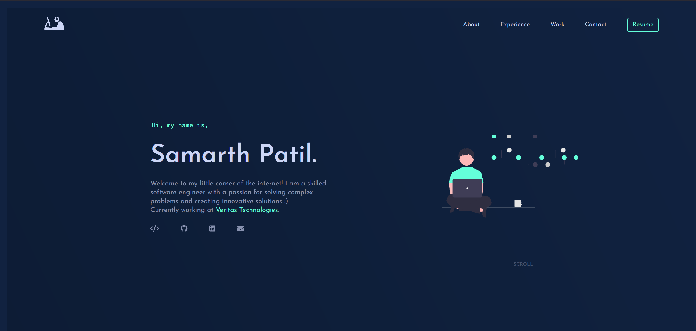

<h2 align="center">
  Sam's World  
  <a href="https://srtpatil.github.io/" target="_blank">srtpatil.github.io</a>
 
  <h3>Personal Portfolio/Blog Website build with React</h3>
</h2>

  

 

 &nbsp;
 &nbsp;
 &nbsp;

## Tech Used

This project was built using these technologies.

- ReactJS
- Sass
- React Icons

## Getting Started

Clone the repository. You will need `node.js` and `git` installed on your machine.

1. Installation: `npm install`

2. In the project directory, you can run: `npm run dev`

Runs the app in the development mode.\
Open [http://localhost:5173](http://localhost:5173) to view it in the browser.

## Show your support

Give a ⭐ if you like this website!
